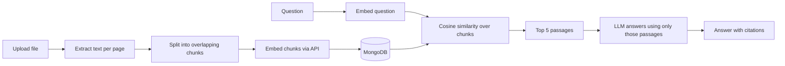

# DocMind

Ask questions about your own documents and get answers with citations you can check.
DocMind is a full-stack **retrieval-augmented generation (RAG)** app built on the MERN stack.

Upload a PDF, Word file, or text file. DocMind splits it into passages, turns each passage into an
embedding (a vector that captures meaning), and stores them in MongoDB. When you ask a question, it finds
the most relevant passages and asks an LLM to answer using only those passages, citing each one.

## Features

- Sign up and sign in with JWT authentication (passwords hashed with bcrypt)
- Upload PDF, DOCX, TXT, and MD files (up to 10 MB), processed in the background
- Per-page citations: every answer links to the exact passage and page it came from
- Search all your documents, or limit a chat to the ones you tick
- Chat history with follow-up questions
- Insights tab: documents, passages, questions, and a 7-day activity chart
- Rate limiting, security headers, input validation, and per-user data isolation

## How it works



| Layer | Tech |
|---|---|
| Frontend | React 18, Vite, Tailwind CSS 4, Recharts |
| Backend | Node.js, Express |
| Database | MongoDB with Mongoose |
| AI | Gemini API (embeddings and text generation) |
| Tooling | node:test, GitHub Actions CI |

## Run it locally

You need Node.js 18 or newer, a MongoDB database (local, or a free MongoDB Atlas cluster), and a free
Gemini API key from https://aistudio.google.com/apikey.

```bash
# 1. Backend
cd server
cp .env.example .env      # then fill in MONGO_URI, JWT_SECRET, GEMINI_API_KEY
npm install
npm run dev               # http://localhost:5000

# 2. Frontend (in a second terminal)
cd client
npm install
npm run dev               # http://localhost:5173
```

Open http://localhost:5173, create an account, upload a document, and ask a question.

Run the tests with `cd server && npm test`.

## Project structure

```
server/src
  index.js            app setup, security middleware, routes
  routes/             auth, documents, chat, stats
  services/ai.js      the only file that talks to the AI provider
  services/rag.js     ingest pipeline and retrieval + answer logic
  models/             User, Document, Chunk, Chat
  utils/              chunker, cosine similarity
client/src
  pages/              AuthPage, Workspace
  components/         Sidebar, ChatPanel, Answer, Insights
```

## API

| Method | Route | Purpose |
|---|---|---|
| POST | /api/auth/register, /api/auth/login | Create an account, sign in |
| GET | /api/auth/me | Current user |
| GET, POST | /api/documents | List documents, upload one |
| DELETE | /api/documents/:id | Delete a document and its passages |
| GET, POST | /api/chat | List chats, ask a question |
| GET, DELETE | /api/chat/:id | Open or delete a chat |
| GET | /api/stats | Dashboard numbers |

## Design decisions worth explaining in an interview

- **Why chunks overlap:** an idea that crosses a chunk boundary stays retrievable from either side.
- **Why separate embedding task types:** documents are embedded as `RETRIEVAL_DOCUMENT` and questions as
  `RETRIEVAL_QUERY`, which the embedding model is tuned for.
- **Why the prompt says to ignore commands inside excerpts:** uploaded documents are untrusted input, so this
  reduces prompt-injection risk.
- **Why upload returns immediately:** embedding can take seconds, so the API replies with status
  `processing` and the client polls until the document is `ready`.
- **Why cosine similarity runs in Node:** it keeps setup simple and works at personal scale. See below
  for the upgrade path.
- **Cost and quota protection:** per-user document limit, chunk limit per file, request rate limits, and
  retry with backoff on 429 errors.

## Ideas to extend it

1. **MongoDB Atlas Vector Search:** create a vector index on `Chunk.embedding` (768 dimensions, cosine) and
   replace the loop in `retrieve()` with a `$vectorSearch` aggregation. This scales to far more documents.
2. **Streaming answers** with server-sent events for a typing effect.
3. **OCR** for scanned PDFs.
4. **Hybrid search:** combine keyword matching with vector similarity.
5. **Evaluation:** write 20 question and answer pairs for a sample document and measure how often the right
   passage lands in the top 5.

## Troubleshooting

- **"model not found" or 404 from the AI API:** model names change. Update `GEMINI_CHAT_MODEL` and
  `GEMINI_EMBED_MODEL` in `server/.env` using the current names in the Gemini API docs.
- **"No readable text found":** the PDF is probably a scan (images of text). Use a text-based PDF.
- **A PDF fails to process:** the PDF reader (`pdf-parse` 1.1.1) uses an older PDF engine and can reject some
  unusual files. Re-save the file with "Print to PDF" and upload that.
- **429 or quota errors:** you hit the free tier limit. Wait a minute and retry.

## Before adding it to your resume

Replace any claim with something you measured yourself, such as the number of documents you tested, typical
response time, or retrieval accuracy from the evaluation idea above. Only list what you can explain.
